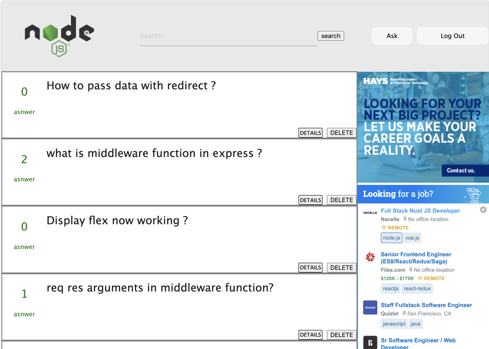
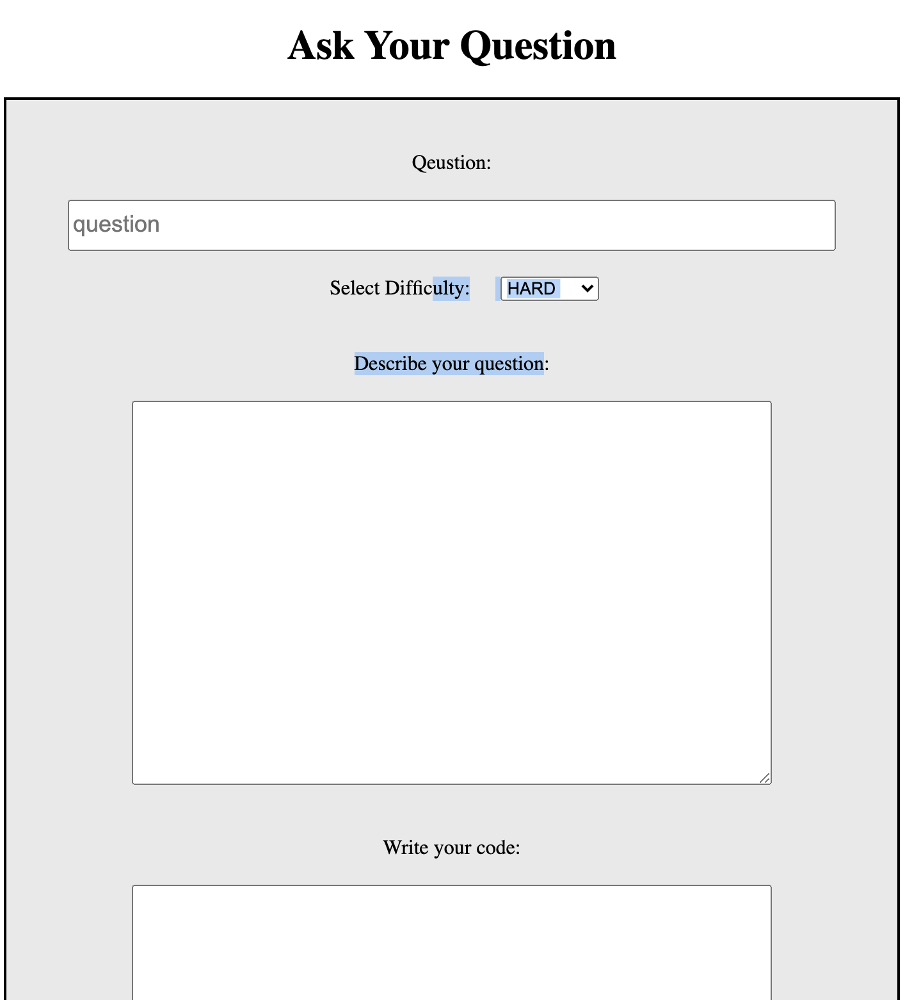

# simple-answer
Simple Answer is web site that people go and ask coding questions and get answer for their questions. In order to ask or answer questions user must log in first. Question can have a many asnwers. On the main page user can see how many answers have been posted. Also user can edit the question and asnwer.  

## Scresnshots

## Technologies Used

- NodeJS
- ExpressJS
- Mongoose
- EJS
- MongoDB

## Getting Started

1. Install dependencies('npm')
2. Start server
3. Open browser

[Deployed Link](https://simple-answers.herokuapp.com/users)  
[Trello Planning Board](https://trello.com/b/3fQ3Yygp/simple-answer)

## Next Step

- I want to add live chat that also can ask questions and answer them
- Add like button
- Aslo only the user of the question can edit the question and answer